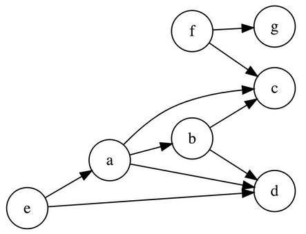
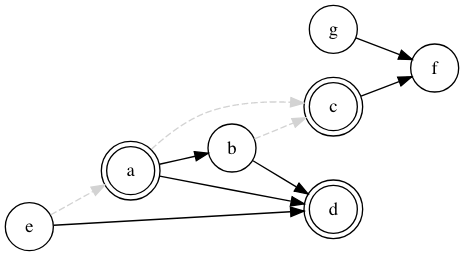

[](https://travis-ci.com/koaning/brent) [](https://ci.appveyor.com/project/koaning/brent)


> They're good DAGs: brent. 

## What it is

Brent is a small, but fun, python library that makes it easy to explore causal graphical modelling and do-calculus
on systems with discrete variables. Brent is a tool that can help out when you can write a system like below, but 
want to write complex queries on it.  

 

## Quickstart 

You can install brent via pip: 

```bash
pip install brent
```

Next we need to have a dataset and create a graph from it. 
The code below demonstrates how to do this.  

```python
from brent import DAG
from brent.common import make_fake_df

dag = (DAG(dataframe=make_fake_df(7))
       .add_edge("e", "a")
       .add_edge("e", "d")
       .add_edge("a", "d")
       .add_edge("b", "d")
       .add_edge("a", "b")
       .add_edge("a", "c")
       .add_edge("b", "c")
       .add_edge("c", "f")
       .add_edge("g", "f"))
dag.plot()
```



Not only do we get pretty plots, but we also can build
an expressive query on top of it. 

```python
from brent import Query
q = Query(dag).given(d=1).do(a=0, c=1)
q.plot()
```



If you're more interested in doing the inference, that's simple 
too. 

```python
# we can also see updated probabilities
q.infer()
q.infer(give_table=True)
```

## Documentation

Liked the quickstart? The documentation (which is generated with [pdoc3](https://github.com/pdoc3/pdoc)) can be found [here](https://koaning.github.io/brent/).

## Alpha Notice 

**NOTE!** this project is in **preview** stages. I think I have something fun here and I've written unit tests on what I'm doing but parts are still going under review. Also there are parts of the library currently missing but which are on a roadmap: 

1. conditional indepdence tests 
2. api for counterfactual queries 
3. more unit tests
4. datasets to start/teach with 
5. clear logging 
6. estimator/transformers for scikit-learn 

## Developing Locally 

After cloning you may install `brent` in the virtual 
environment via:

```bash
$ pip install --editable .
```

You can generate documentation locally by running: 

```bash
$ pdoc --html --overwrite --template-dir doc-settings --http 0.0.0.0:12345 brent
```
